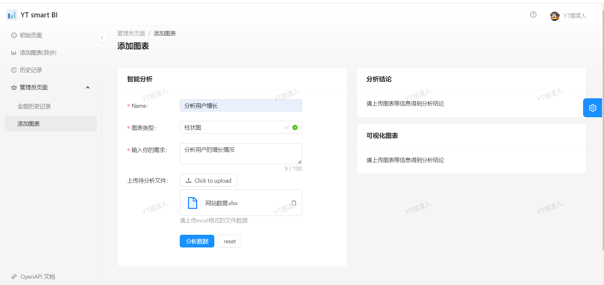

# 智能BI项目

智能BI项目是一个对于用户输入的表格格式的数据进行分析，使用AI进行分析，分析后的结论和图表会返回给前端

### 前端技术栈：

1. react
2. Echarts
3. ant design pro
4. websocket

### 后端技术栈

1. spring boot 2.7.x 以及一系列
2. RabbitMq
3. netty 的 websocket
4. redis 主要用于限流和存储用户验证码
5. 多线程来进行异步返回结果

## 功能展示

登录和邮箱登录功能

初始页面

异步添加图表：

主动响应：

历史记录：

管理员可查看所有的用户的分析数据并使用单线程的方式分析数据，方便管理员测试功能：

等待一会可得到结论

### 大概制作流程

1. 使用ant design pro 和 spring boot构建前后端基础框架
2. 使用同步的方式给AI发送请求并构建返回结果
3. 因为使用同步的方式调用AI接口，所以需要控制限流，项目中是使用redis的redisson框架提供的限流机制来实现限流
4. 为了避免用户一直在当前页面一直等待返回，所以升级提交给AI进行分析的这部分流程为异步的
5. 为了查看异步后的分析结果，所以制作了一个历史记录页面用来查看当前用户的历史提交数据分析记录
6. 为了提高用户的体验，使用websocket连接前后端，使得后端当得到分析结论的时候，能够主动地告诉用户当前已经分析完毕了
7. 附加功能：
   1. 将之前的同步得到分析结果的功能只提供给管理员，普通用户只能使用异步的方式
   2. 给管理员用户提供一个查看所有的用户的分析的记录的页面，给管理员更高级的权限。

