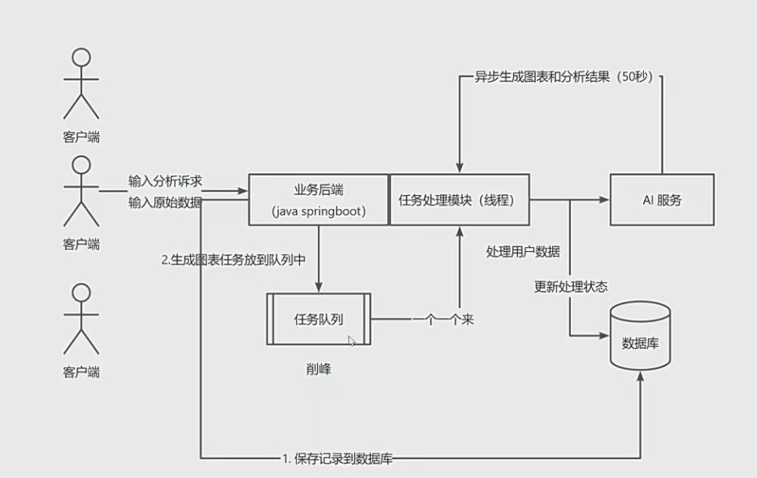

# 智能BI

## 需求

1. 智能分析：用户输入目标和原始数据（图表类型），可以自动生成图表和分析结论
2. 图表管理
3. 图表生成的异步化（消息队列）
4. 对接AI能力

## 架构图


## 准备使用技术栈

### 前端

1. React

2. Umi + Ant Design Pro
3. Echarts
4. umi openai 代码生成

### 后端

1. Spring Boot
2. MySql 
3. MyBatis Plus 数据访问框架
4. AI
5. Excel的上传和数据的解析
6. Swagger + Knife4j


## 2023-6-20

### 前端项目初始化

1. 去除国际化

### 后端项目初始化

1. 设计表结构,修改建表语句
2. 根据表结构创建mapper和service层代码
3. 去除无用代码
4. 逻辑删除
5. 生成编写对应的增删改查

### 明日计划

编写controller

## 2023-6-21

### 使用反向代理

### 前端去掉无用文件

去掉无用文件，然后页面构造

### 前后端联调

实现登录部分对接

## 2023-6-22

#### 实现excel文件上传

```
分析需求:
线型图
原始数据:
日期,用户数
1号,10
2号,20
3号,30
4号,40
5号,50
6号,60
7号,70
8号,80
9号,90
10号,100
11号,110
12号,120
```


## 2023-6-23

联调ai

问：

```
你是一个数据分析师和前端开发专家，接下来我会按照以下固定格式给你提供内容
分析需求:
饼图
原始数据:
日期,用户数
1号,10
2号,20
3号,30
4号,40
5号,50
6号,60
7号,70
8号,80
9号,90
10号,100
11号,110
12号,120
请根据这两部分内容，按照以下格式生成内容(此外不要输出任何多余的开头、结尾、注释)
【【【【【
{前端Echarts V5的option配置对象js，合理地将数据进行可视化，不需要任何多余的内容，比如注释}
【【【【【
{明确的数据分析结论，越详细越好，不需要多余的注释}
```

预设回答

```
【【【【【
{
title: {
text: '用户数统计',
left: 'center'
},
tooltip: {
trigger: 'item',
formatter: '{b}: {c}'
},
series: [
{
type: 'pie',
radius: ['50%', '70%'],
label: {
show: true,
formatter: '{b}: {c} ({d}%)'
},
data: [
{value: 10, name: '1号'},
{value: 20, name: '2号'},
{value: 30, name: '3号'},
{value: 40, name: '4号'},
{value: 50, name: '5号'},
{value: 60, name: '6号'},
{value: 70, name: '7号'},
{value: 80, name: '8号'},
{value: 90, name: '9号'},
{value: 100, name: '10号'},
{value: 110, name: '11号'},
{value: 120, name: '
```


## 2023-6-24

联调ai

完成分析数据并保存到数据库中

设计前端上传表格页面


## 2023-6-25

设计图表和返回结果展示

#### echart-for-react

引入echarts-for-react库来更方便地在react中使用echarts

> https://git.hust.cc/echarts-for-react/

> npm install echarts-for-react

引入代码：

```jsx
import React from 'react';
import ReactECharts from 'echarts-for-react';

const Page: React.FC = () => {
  const options = {
    grid: { top: 8, right: 8, bottom: 24, left: 36 },
    xAxis: {
      type: 'category',
      data: ['Mon', 'Tue', 'Wed', 'Thu', 'Fri', 'Sat', 'Sun'],
    },
    yAxis: {
      type: 'value',
    },
    series: [
      {
        data: [820, 932, 901, 934, 1290, 1330, 1320],
        type: 'line',
        smooth: true,
      },
    ],
    tooltip: {
      trigger: 'axis',
    },
  };

  return <ReactECharts option={options} />;
};

export default Page;
```

```
你是一个数据分析师和前端开发专家，接下来我会按照以下固定格式给你提供内容：
分析需求：
{数据分析的需求或者目标}
原始数据：
{csv格式的原始数据，用,作为分隔符}
请根据这两部分内容，按照以下指定格式生成内容（此外不要输出任何多余的开头、结尾、注释）
【【【【【
{前端 Echarts V5 的 option 配置对象json代码，合理地将数据进行可视化，不要生成任何多余的内容，比如注释}
【【【【【
{明确的数据分析结论、越详细越好，不要生成多余的注释}
```

```
【【【【【
{
"xAxis": {
"type": 'category',
"data": ['1号', '2号', '3号', '4号', '5号', '6号', '7号', '8号', '9号', '10号', '11号', '12号']
},
"yAxis": {
"type": 'value'
},
"series": [{
"data": [10, 20, 30, 40, 50, 60, 70, 80, 90, 100, 110, 120],
"type": 'line'
}]
}
【【【【【
通过对数据进行分析，可以得出以下结论：

从1号到12号，用户数量呈现逐渐上升的趋势，可以认为是网站或者产品吸引用户的效果在逐渐提高。
可以发现，用户数的增幅没有出现剧烈波动，比较平稳，因此建议继续保持产品的稳定发展态势，不要采用大规模变革或者刺激活动等，避免引起用户不必要的负面情绪。
```

```
【【【【【
{
"xAxis": {
"type": "category",
"data": ["6号", "7号", "8号", "9号", "10号", "11号", "12号"]
},
"yAxis": {
"type": "value"
},
"series": [{
"data": [60, 70, 80, 90, 100, 110, 120],
"type": "line"
}]
}
【【【【【
根据数据分析，可以得出以下结论：

从6号开始，用户数量呈现逐渐上升的趋势，直至12号达到了最高峰，增长较为平稳，说明网站或者产品的吸引力逐渐提升，用户数量呈现快速增长。
可以针对数据中的这部分时间段，对产品或者网站进行进一步分析，找出比较准确的用户增长原因，可能是某些活动的有效引流，或者产品进行了一定的优化等，将这些原因总结下来，可以将其作为之后产品或网站稳定增长的有益借鉴。
```

完成分析和展示


```
分析需求:
线型图
原始数据:
日期,用户数
1号,10
2号,20
3号,30
4号,40
5号,50
6号,60
7号,70
8号,80
9号,90
10号,100
11号,110
12号,120
```

```
分析需求:
分析用户的增长情况,请使用堆叠图
原始数据:
日期,用户数
1号,10
2号,20
3号,30
4号,40
5号,50
6号,60
7号,0
8号,80
9号,90
10号,190
11号,110
12号,120
```

数据中不能有0，否则会出现hutool的json解析错误

结果：


大致架构如下


，接下来需要提升系统稳定性

# 2023-07-05

开发历史分析数据的页面

引入list组件，调整内容

# 2023-07-09

## 限流的实现

1. 固定窗口限流
2. 滑动窗口限流
3. 漏桶限流，推荐
4. 令牌桶限流，推荐 

### 单机的限流

### 分布式的限流

# 2024-07-10

问题场景：调用的服务处理能力有限，或者接口的处理（或返回）时长较长时，就应该考虑异步化了

1. 用户等待时间有点长（因为要等AI生成）
2. 业务服务器可能会有很多请求在处理，导致系统资源紧张，严重时导致服务器宕机或者无法处理新的请求
3. 调用的第三方请求（AI能力）的处理能力是有限的，比如每3秒只能处理不过来，严重时 AI可能会对咱们的后台系统拒绝服务。

**异步化 业务流程：**

1. 当用户要进行耗时很长的操作的时候，点击提交后，不需要再界面傻等，而是应该把这个任务保存到数据库中记录下来
2. 把用户执行的操作（任务）放到一个任务队列中，让程序（线程）从任务队列中取出任务去执行
   1. 任务提交成功：任务队列没有满
      1. 如果程序还有空余的线程，可以立刻去做这个任务
      2. 如果程序的线程都在忙，无法继续处理，就放到等待队列里
   2. 任务提交失败：如果程序的所有线程都在忙，任务队列也满了
      1. 拒绝掉这个任务，再也不去执行了
      2. 通过保存到数据库中的记录来看到提交失败的任务，并且在程序空闲的时候，可以把任务从数据库中捞到程序里再去执行

3. 线程从任务队列中取出任务依次执行，每完成完一件事要修改一下状态
4. 用户可以查询任务的执行状况，或者在任务执行成功的或失败的时候能够得到通知（发邮件）
5. 如果要执行的任务非常复杂，包含很多环节，在每一个小任务完成时，要在程序（数据库中）记录一下任务的执行状态（进度）

实现逻辑：

点击提交的时候，就立刻保存到数据库中作为一个任务

用户可以在图表管理页面查看所有的图表，已生成的，生成中的，生成失败的 信息和状态



1. 最大容量是多少
2. 从任务队列中取出任务去执行，这个任务队列的流程怎么实现，怎么保证程序最多同时执行多少个任务


### 线程池

#### 为什么需要线程池

1. 线程管理比较复杂，比如什么时候新增线程、什么时候减少空闲线程
2. 任务存取比较复杂，什么时候接受任务，什么时候拒任务、怎么保证不抢到同一个任务

帮助轻松管理线程，协调任务的执行过程


尽量使用JUC并发编程包中的线程池创建方式:

创建参数：

1. corePoolSize: 核心线程数，正常情况下系统应该同时能够工作的线程数
2. maximumPoolSize:最大线程数，极限情况下，我们的线程池最多有多少个线程
3. keepAliveTime：空闲线程存活时间，非核心线程没有任务的情况下，过多久要删除，从而释放无用资源
4. TimeUnit unit：时间单位
5. workQueue：工作队列，用于存放给线程执行的任务，存在队列的最大长度（不要无限）
6. threadFactory:控制每个线程的生成、线程的属性（比如线程名）
7. RejectedExecutionHandler:拒绝策略，队伍队列满的时候采取什么措施，比如抛异常，不抛异常，自定义策略

> 资源隔离：比如重要的任务（VIP任务）一个队列，普通任务一个队列，保证这两个队伍不互相干扰


一般情况下，任务分为 IO密集型和计算密集型两种

**计算密集型：**吃CPU，比如音视频、图像处理、数学计算等，一般是设置corePoolSize为CPU的核数 +1（空余线程），可以让每个线程都能利用好CPU的每个核，而且线程之间不用频繁切换（减少打架，减少开销）

**IO密集型：**吃带宽/内存/硬盘 的读写资源，corePoolSize 可以设置大一点，一般经验值是2n左右，但是建议以IO的能力为主

**配置：**

```java
package com.yt.ytbibackend.controller;

import cn.hutool.json.JSONUtil;
import org.springframework.web.bind.annotation.GetMapping;
import org.springframework.web.bind.annotation.RequestMapping;
import org.springframework.web.bind.annotation.RestController;

import javax.annotation.Resource;
import java.util.HashMap;
import java.util.Map;
import java.util.concurrent.CompletableFuture;
import java.util.concurrent.ThreadPoolExecutor;

@RestController
@RequestMapping("/queue")
public class QueueController {

    @Resource
    private ThreadPoolExecutor threadPoolExecutor;

    @GetMapping("/add")
    public void add(String name) {
        CompletableFuture.runAsync(() -> {
            System.out.println(Thread.currentThread().getName() + "-执行任务中：" + name);
            try {
                Thread.sleep(60000);
            } catch (InterruptedException e) {
                e.printStackTrace();
            }
        }, threadPoolExecutor);
    }


    @GetMapping("/get")
    public String get() {
        Map<String, Object> map = new HashMap<>();
        int size = threadPoolExecutor.getQueue().size();
        map.put("队列长度", size);
        long taskCount = threadPoolExecutor.getTaskCount();
        map.put("任务总数", taskCount);
        long completedTaskCount = threadPoolExecutor.getCompletedTaskCount();
        map.put("已完成工作的线程数", completedTaskCount);
        long activeCount = threadPoolExecutor.getActiveCount();
        map.put("正在工作的线程数", activeCount);
        return JSONUtil.toJsonStr(map);
    }

}
```

完成线程池配置：

后续开发：

1. 给数据库添加一个字段，比如派对中，执行中，已完成，失败，任务执行信息字段（用于记录任务执行中，或者失败的一些信息）
2. 用户点击智能分析页的提交按钮的时候，立刻将图表保存到数据库中，然后提交任务
3. 任务，先修改图表任务状态为 ”执行中“，等执行成功后修改为”已完成“，保存执行结果，执行失败后，状态修改为”失败“，记录任务失败信息
4. 用户可以在图表管理页面查看所有图表（已生成的、生成中的、生成失败的）信息和状态

优化：

1. guava Retrying 重试
2. 如果说任务根本没有提交到任务队列中，是不是可以用定时任务把“失败的”放到队列中 - 补偿方式？？？
3. 超时控制
4. 反向压力，根据情况选择同步还是异步
5. 设置一个刷新按钮？？，或者使用websocket方式获得消息

引入netty：

```xml
<dependency>
            <groupId>io.netty</groupId>
            <artifactId>netty-all</artifactId>
</dependency>
```


## 2023-07-26

使用分布式的消息队列，预计使用ribbitmq

1. 无法集中限制，只能单机部署
2. 任务由于是放在内存中执行的，很有可能会丢失

todo：

将服务拆分，把长耗时，消耗很多的任务单独抽离出去


#### 分布式消息队列：

1. 数据持久化
2. 可拓展性：可以根据需求同时增加或者减少节点，持续保持稳定的服务
3. 应用解耦：连接不同系统

4. 发布订阅

##### 应用场景

1. 耗时的场景
2. 高并发场景（异步，削峰填谷）
3. 分布式系统协作（跨团队，跨业务合作）
4. 强稳定性的场景

只要是分布式系统就有数据的一致性，包括使用消息队列

##### 决定使用

使用场景

| 技术名称 | 吞吐量 | 时效性         | 可用性 | 可靠性 | 优势                                                     | 应用场景                                                     |
| -------- | ------ | -------------- | ------ | ------ | -------------------------------------------------------- | ------------------------------------------------------------ |
| activemq | 万级   | 高             | 高     | 高     | 简单                                                     | 中小型项目                                                   |
| rabbitmq | 万级   | 极高（微秒）   | 高     | 高     | 生态好                                                   | 适合绝大多数分布式应用                                       |
| kafka    | 十万级 | 高（毫秒以内） | 极高   | 极高   | 吞吐量大，可靠性，可拓展性都高，有很强大的数据流处理能力 | 适用于大规模处理数据的场景，比如架构日志收集系统，实时数据流传输、事件流收集传输 |
| rocketmq | 十万级 | 高（ms）       | 极高   | 极高   | 吞吐量大，可靠性，可用性，可拓展性                       | 使用于**金融**、社交、电商等对可靠性要求较高的场景、适用于大规模的消息处理 |
| pulsar   | 十万级 | 高（ms）       | 极高   | 极高   | 可靠性、可用性很高，新兴（ji'shu'jia'gou先进）           | 适合大规模、高并发的分布式系统（云原生）。适合实时分析、事件流处理， |


ribbitmq

> https://www.rabbitmq.com/getstarted.html

AMQP协议：

> https://www.rabbitmq.com/tutorials/amqp-concepts.html

高级消息队列协议：Advanced Message Queue Protocol

启动管理页面：

> rabbitmq-plugins.bat enable rabbitmq_management

> http://localhost:15672/#/channels
>
> guest
>
> guest

ribbitmq端口占用:

1.  5672：程序连接的端口
2. 15672：webUI

测试：

send：

```java
import com.rabbitmq.client.Channel;
import com.rabbitmq.client.Connection;
import com.rabbitmq.client.ConnectionFactory;

import java.nio.charset.StandardCharsets;

public class Send {

    private final static String QUEUE_NAME = "hello";

    public static void main(String[] argv) throws Exception {
        ConnectionFactory factory = new ConnectionFactory();
        factory.setHost("localhost");
        try (Connection connection = factory.newConnection();
             Channel channel = connection.createChannel()) {
            channel.queueDeclare(QUEUE_NAME, false, false, false, null);
            String message = "Hello World!";
            channel.basicPublish("", QUEUE_NAME, null, message.getBytes(StandardCharsets.UTF_8));
            System.out.println(" [x] Sent '" + message + "'");
        }
    }
}
```

ribbitmq手动确认某条消息：

 ```java
 channel.basicAck(delivery.getEnvelope().getDeliveryTag(), false);
 // 这里的第一个参数确定是哪个消息
 // 第二个消息说是否将之前积压的消息都确认掉
 ```

 拒绝某条消息

```java
channel.basicNack(delivery.getEnvelope().getDeliveryTag(), false, false);
// 第二稿消息是是否将之前的消息都拒绝掉
// 第三个消息是是否将当前的消息给放回给队列中（是否重新入队，是否重试）
```


# 2023-7-23

配置加入消息队列ribbitMQ

引入依赖

```
<!--https://mvnrepository.com/artifact/org.springframework.boot/spring-boot-starter-amqp -->
<dependency>
    <groupId>org.springframework.boot</groupId>
    <artifactId>spring-boot-starter-amqp</artifactId>
</dependency>
```

### 修改逻辑：

1. 把任务提交改为向队列发送消息
2. 写一个专门的接受消息的程序，处理任务
3. 如果程序中断了，消息未被确认，还会重发吗
4. 现在，消息全部集中发送到消息队列，可以部署多个后端，从同一个地方取出任务，从而实现分布式负载均衡


### 后续优化点：

1. 开发将失败的放到死信队列中处理


# 2023-7-24

实现netty：

以下是实现消息推送的基本步骤：

步骤1：创建Spring Boot项目 首先，使用Spring Initializr（https://start.spring.io/）创建一个新的Spring Boot项目。选择所需的依赖，包括"Spring Web"和"Thymeleaf"（用于创建简单的WebSocket客户端）。

步骤2：添加Netty依赖 打开生成的项目，编辑pom.xml文件，添加Netty的依赖。在dependencies节点下添加以下依赖：

```
xmlCopy code<dependency>
    <groupId>io.netty</groupId>
    <artifactId>netty-all</artifactId>
    <version>4.1.66.Final</version>
</dependency>
```

步骤3：创建WebSocket处理器 创建一个WebSocket处理器，它将处理所有传入的WebSocket连接和消息。在src/main/java目录下创建一个新的包，例如com.example.websocket，然后在该包中创建一个名为WebSocketHandler的类。这个类需要继承自`io.netty.channel.SimpleChannelInboundHandler`。

```
javaCopy codepackage com.example.websocket;

import io.netty.channel.ChannelHandlerContext;
import io.netty.channel.SimpleChannelInboundHandler;
import io.netty.handler.codec.http.websocketx.TextWebSocketFrame;

public class WebSocketHandler extends SimpleChannelInboundHandler<TextWebSocketFrame> {

    @Override
    protected void channelRead0(ChannelHandlerContext ctx, TextWebSocketFrame msg) throws Exception {
        // 在这里处理接收到的WebSocket消息
        String message = msg.text();
        System.out.println("Received message: " + message);

        // 这里可以添加处理逻辑，比如将消息推送给所有连接的客户端
        // ...
    }

    @Override
    public void exceptionCaught(ChannelHandlerContext ctx, Throwable cause) {
        cause.printStackTrace();
        ctx.close();
    }
}
```

步骤4：配置Netty服务器 创建一个Netty服务器来接受WebSocket连接并处理消息。在src/main/java目录下创建一个新的包，例如com.example.netty，然后在该包中创建一个名为NettyServer的类。

```
javaCopy codepackage com.example.netty;

import com.example.websocket.WebSocketHandler;
import io.netty.bootstrap.ServerBootstrap;
import io.netty.channel.ChannelInitializer;
import io.netty.channel.ChannelOption;
import io.netty.channel.EventLoopGroup;
import io.netty.channel.nio.NioEventLoopGroup;
import io.netty.channel.socket.nio.NioServerSocketChannel;
import io.netty.handler.codec.http.HttpObjectAggregator;
import io.netty.handler.codec.http.HttpServerCodec;
import io.netty.handler.codec.http.websocketx.WebSocketServerProtocolHandler;

public class NettyServer {

    private final int port;

    public NettyServer(int port) {
        this.port = port;
    }

    public void start() throws Exception {
        EventLoopGroup bossGroup = new NioEventLoopGroup();
        EventLoopGroup workerGroup = new NioEventLoopGroup();
        try {
            ServerBootstrap bootstrap = new ServerBootstrap();
            bootstrap.group(bossGroup, workerGroup)
                    .channel(NioServerSocketChannel.class)
                    .childHandler(new ChannelInitializer<>() {
                        @Override
                        protected void initChannel(io.netty.channel.Channel ch) {
                            ch.pipeline().addLast(new HttpServerCodec());
                            ch.pipeline().addLast(new HttpObjectAggregator(65536));
                            ch.pipeline().addLast(new WebSocketServerProtocolHandler("/websocket"));
                            ch.pipeline().addLast(new WebSocketHandler());
                        }
                    })
                    .option(ChannelOption.SO_BACKLOG, 128)
                    .childOption(ChannelOption.SO_KEEPALIVE, true);

            bootstrap.bind(port).sync().channel().closeFuture().sync();
        } finally {
            bossGroup.shutdownGracefully();
            workerGroup.shutdownGracefully();
        }
    }

    public static void main(String[] args) throws Exception {
        int port = 8080; // 设置WebSocket服务器监听的端口号
        NettyServer server = new NettyServer(port);
        server.start();
    }
}
```

步骤5：运行WebSocket客户端 为了测试WebSocket服务器，你可以创建一个简单的WebSocket客户端。你可以使用浏览器中的JavaScript代码或Thymeleaf模板来创建一个简单的WebSocket客户端。

在src/main/resources/templates目录下创建一个名为index.html的文件，包含以下内容：

```
htmlCopy code<!DOCTYPE html>
<html>
<head>
    <title>WebSocket Client</title>
    <script>
        var socket = new WebSocket('ws://localhost:8080/websocket');

        socket.onopen = function(event) {
            console.log('WebSocket is connected.');
        };

        socket.onmessage = function(event) {
            console.log('Received message: ' + event.data);
        };
    </script>
</head>
<body>
    <h1>WebSocket Client</h1>
</body>
</html>
```

这个WebSocket客户端将连接到我们刚刚创建的WebSocket服务器，并在控制台上打印接收到的消息。

步骤6：运行应用程序 现在你可以运行Spring Boot应用程序，并访问http://localhost:8080/ 来加载WebSocket客户端。在控制台中你应该看到“WebSocket is connected.”的消息。同时，当服务器接收到消息时，你也将在控制台中看到“Received message: xxx”的消息。

至此，你已经成功地使用Spring Boot和Netty实现了消息推送。注意这只是一个简单的示例，实际应用中你需要根据需求添加更多的功能和安全措施。


> [noTryNoHard/NettyAndWebsocket: SpringBoot2+Netty+WebSocket实现TCP服务端消息推送到前台页面 (github.com)](https://github.com/noTryNoHard/nettyAndWebsocket)

使用redis存储键值对的方式来存储用户对应的websocket session

用户名：session

通过将生成的uuid即auth作为key，sessionId作为value存入redis中

然后在建立连接的时候，将auth返回给前端，前端全局保存，当需要的时候拿出来使用

通过这个auth到后端的时候，拿到对应的sessionId，然后再通过这个sessionId来发送数据


# 2023-7-27

编写邮箱绑定和注册功能

项目收尾并编写文档AI

将全局的一些常量抽离出来
