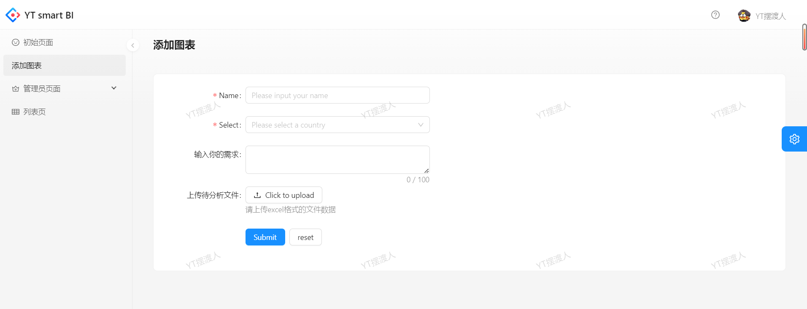
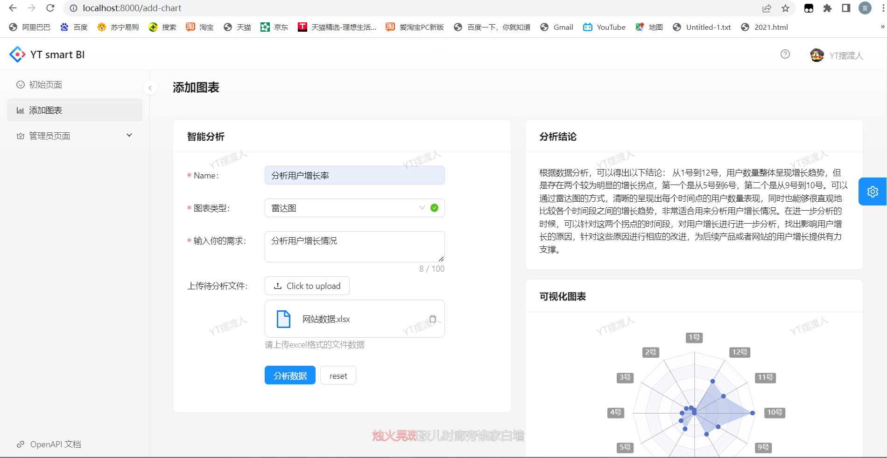
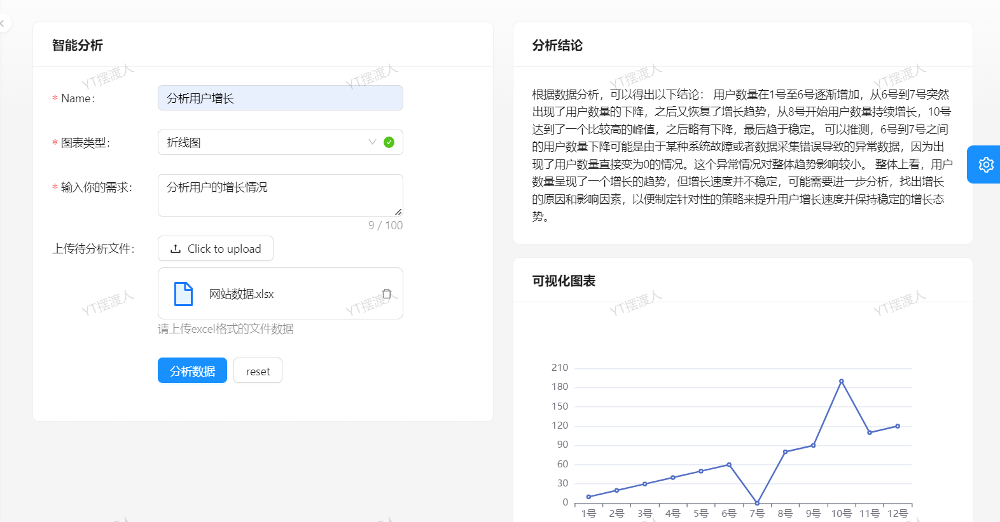

# 智能BI

## 需求

1. 智能分析：用户输入目标和原始数据（图表类型），可以自动生成图表和分析结论
2. 图表管理
3. 图表生成的异步化（消息队列）
4. 对接AI能力

## 架构图


## 准备使用技术栈

### 前端

1. React

2. Umi + Ant Design Pro
3. Echarts
4. umi openai 代码生成

### 后端

1. Spring Boot
2. MySql 
3. MyBatis Plus 数据访问框架
4. AI
5. Excel的上传和数据的解析
6. Swagger + Knife4j


## 2023-6-20

### 前端项目初始化

1. 去除国际化

### 后端项目初始化

1. 设计表结构,修改建表语句
2. 根据表结构创建mapper和service层代码
3. 去除无用代码
4. 逻辑删除
5. 生成编写对应的增删改查

### 明日计划

编写controller

## 2023-6-21

### 使用反向代理

### 前端去掉无用文件

去掉无用文件，然后页面构造

### 前后端联调

实现登录部分对接

## 2023-6-22

#### 实现excel文件上传

```
分析需求:
线型图
原始数据:
日期,用户数
1号,10
2号,20
3号,30
4号,40
5号,50
6号,60
7号,70
8号,80
9号,90
10号,100
11号,110
12号,120
```


## 2023-6-23

联调ai

问：

```
你是一个数据分析师和前端开发专家，接下来我会按照以下固定格式给你提供内容
分析需求:
饼图
原始数据:
日期,用户数
1号,10
2号,20
3号,30
4号,40
5号,50
6号,60
7号,70
8号,80
9号,90
10号,100
11号,110
12号,120
请根据这两部分内容，按照以下格式生成内容(此外不要输出任何多余的开头、结尾、注释)
【【【【【
{前端Echarts V5的option配置对象js，合理地将数据进行可视化，不需要任何多余的内容，比如注释}
【【【【【
{明确的数据分析结论，越详细越好，不需要多余的注释}
```

预设回答

```
【【【【【
{
title: {
text: '用户数统计',
left: 'center'
},
tooltip: {
trigger: 'item',
formatter: '{b}: {c}'
},
series: [
{
type: 'pie',
radius: ['50%', '70%'],
label: {
show: true,
formatter: '{b}: {c} ({d}%)'
},
data: [
{value: 10, name: '1号'},
{value: 20, name: '2号'},
{value: 30, name: '3号'},
{value: 40, name: '4号'},
{value: 50, name: '5号'},
{value: 60, name: '6号'},
{value: 70, name: '7号'},
{value: 80, name: '8号'},
{value: 90, name: '9号'},
{value: 100, name: '10号'},
{value: 110, name: '11号'},
{value: 120, name: '
```


## 2023-6-24

联调ai

完成分析数据并保存到数据库中

设计前端上传表格页面



## 2023-6-25

设计图表和返回结果展示

#### echart-for-react

引入echarts-for-react库来更方便地在react中使用echarts

> https://git.hust.cc/echarts-for-react/

> npm install echarts-for-react

引入代码：

```jsx
import React from 'react';
import ReactECharts from 'echarts-for-react';

const Page: React.FC = () => {
  const options = {
    grid: { top: 8, right: 8, bottom: 24, left: 36 },
    xAxis: {
      type: 'category',
      data: ['Mon', 'Tue', 'Wed', 'Thu', 'Fri', 'Sat', 'Sun'],
    },
    yAxis: {
      type: 'value',
    },
    series: [
      {
        data: [820, 932, 901, 934, 1290, 1330, 1320],
        type: 'line',
        smooth: true,
      },
    ],
    tooltip: {
      trigger: 'axis',
    },
  };

  return <ReactECharts option={options} />;
};

export default Page;
```

```
你是一个数据分析师和前端开发专家，接下来我会按照以下固定格式给你提供内容：
分析需求：
{数据分析的需求或者目标}
原始数据：
{csv格式的原始数据，用,作为分隔符}
请根据这两部分内容，按照以下指定格式生成内容（此外不要输出任何多余的开头、结尾、注释）
【【【【【
{前端 Echarts V5 的 option 配置对象json代码，合理地将数据进行可视化，不要生成任何多余的内容，比如注释}
【【【【【
{明确的数据分析结论、越详细越好，不要生成多余的注释}
```

```
【【【【【
{
"xAxis": {
"type": 'category',
"data": ['1号', '2号', '3号', '4号', '5号', '6号', '7号', '8号', '9号', '10号', '11号', '12号']
},
"yAxis": {
"type": 'value'
},
"series": [{
"data": [10, 20, 30, 40, 50, 60, 70, 80, 90, 100, 110, 120],
"type": 'line'
}]
}
【【【【【
通过对数据进行分析，可以得出以下结论：

从1号到12号，用户数量呈现逐渐上升的趋势，可以认为是网站或者产品吸引用户的效果在逐渐提高。
可以发现，用户数的增幅没有出现剧烈波动，比较平稳，因此建议继续保持产品的稳定发展态势，不要采用大规模变革或者刺激活动等，避免引起用户不必要的负面情绪。
```

```
【【【【【
{
"xAxis": {
"type": "category",
"data": ["6号", "7号", "8号", "9号", "10号", "11号", "12号"]
},
"yAxis": {
"type": "value"
},
"series": [{
"data": [60, 70, 80, 90, 100, 110, 120],
"type": "line"
}]
}
【【【【【
根据数据分析，可以得出以下结论：

从6号开始，用户数量呈现逐渐上升的趋势，直至12号达到了最高峰，增长较为平稳，说明网站或者产品的吸引力逐渐提升，用户数量呈现快速增长。
可以针对数据中的这部分时间段，对产品或者网站进行进一步分析，找出比较准确的用户增长原因，可能是某些活动的有效引流，或者产品进行了一定的优化等，将这些原因总结下来，可以将其作为之后产品或网站稳定增长的有益借鉴。
```

完成分析和展示



```
分析需求:
线型图
原始数据:
日期,用户数
1号,10
2号,20
3号,30
4号,40
5号,50
6号,60
7号,70
8号,80
9号,90
10号,100
11号,110
12号,120
```

```
分析需求:
分析用户的增长情况,请使用堆叠图
原始数据:
日期,用户数
1号,10
2号,20
3号,30
4号,40
5号,50
6号,60
7号,0
8号,80
9号,90
10号,190
11号,110
12号,120
```

数据中不能有0，否则会出现hutool的json解析错误

结果：



大致架构如下，接下来需要提升系统稳定性

# 2023-07-05

开发历史分析数据的页面

引入list组件，调整内容

