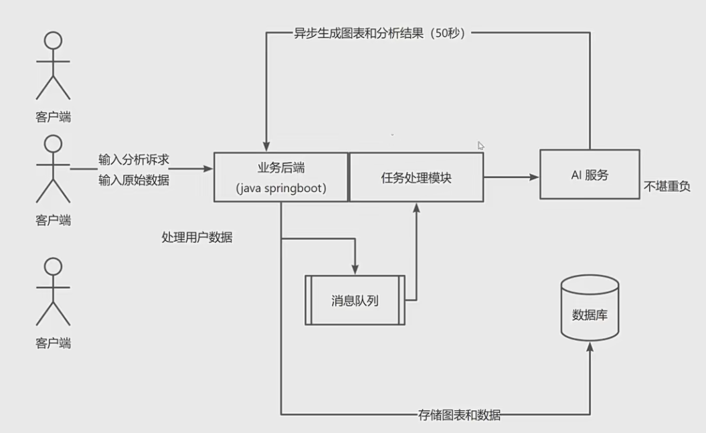

# 智能BI

## 需求

1. 智能分析：用户输入目标和原始数据（图表类型），可以自动生成图表和分析结论
2. 图表管理
3. 图表生成的异步化（消息队列）
4. 对接AI能力

## 架构图

## 准备使用技术栈

### 前端

1. React

2. Umi + Ant Design Pro
3. Echarts
4. umi openai 代码生成

### 后端

1. Spring Boot
2. MySql 
3. MyBatis Plus 数据访问框架
4. AI
5. Excel的上传和数据的解析
6. Swagger + Knife4j

## 2023-6-20

### 前端项目初始化

